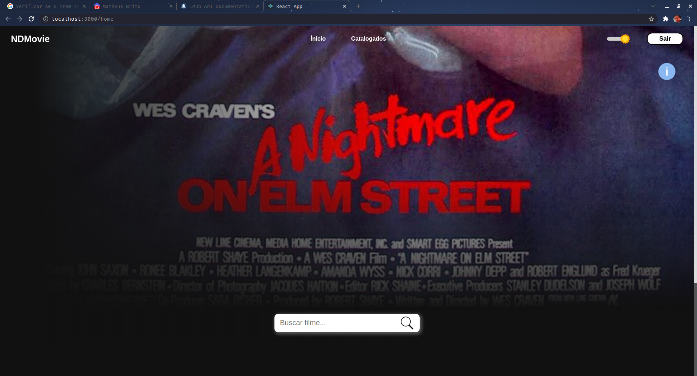
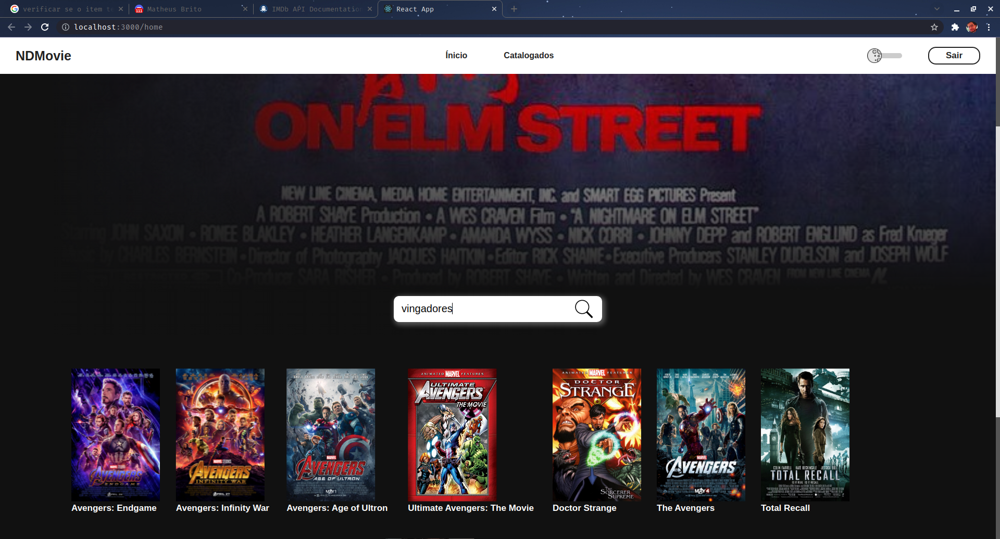
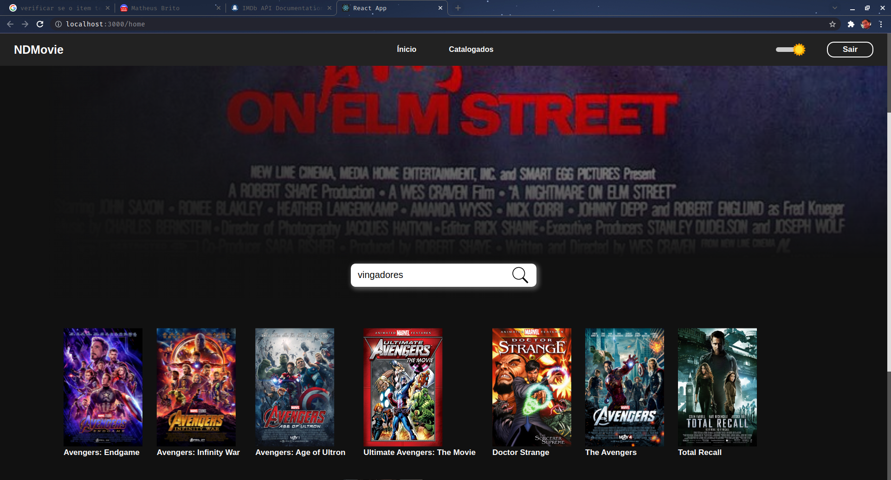
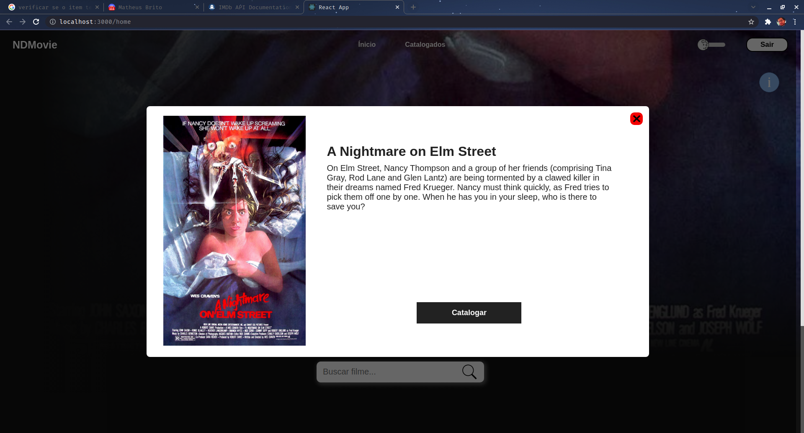
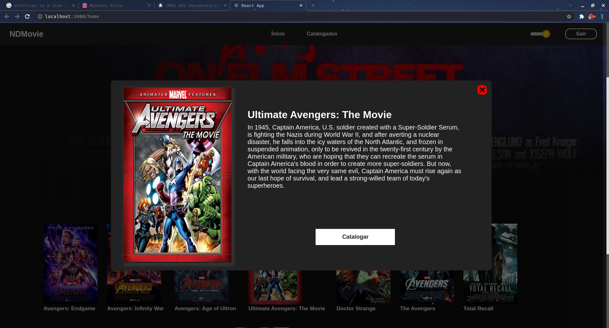
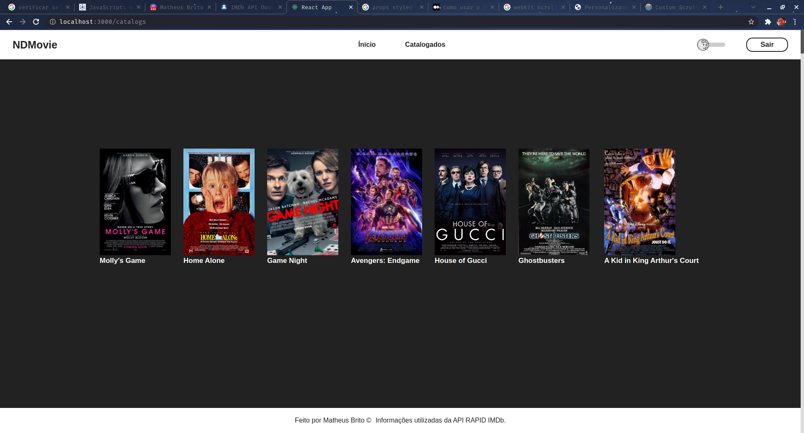
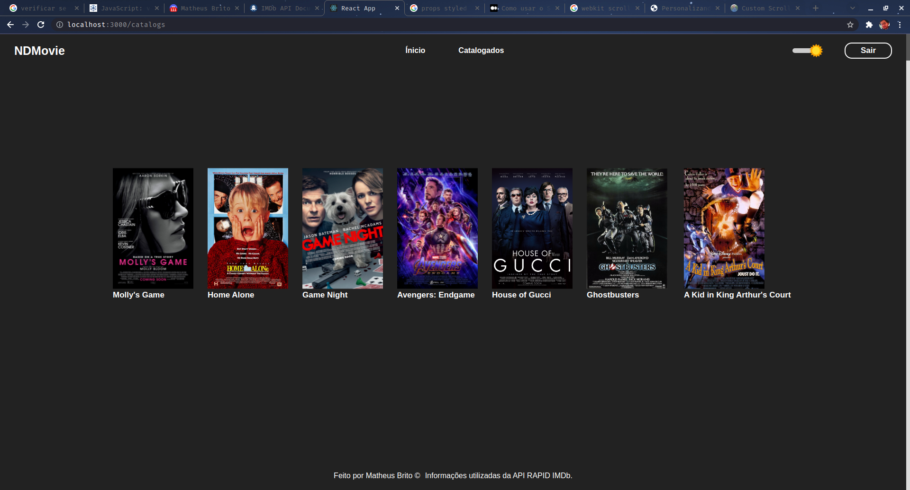

Optei em utilizar o SQLite, por conta da simplicidade e agilidade tanto para desenvolver, quanto para ser executado em outro ambiente de desenvolvimento.

Para utilizar o projeto basta fazer um clone do repositório, entrar na pasta backend e rodar o comando "npm install" ou "yarn", 
e fazer o mesmo na pasta frontend. Isso instalará as dependências, lembrando que você tem que ter o node instalado em sua máquina.

Após instalar as dependências, na pasta backend rode o comando "npm run dev" ou "yarn dev", na pasta frontend execute "npm run start" ou "yarn start".
No banco de dados tem o usuário padrão pedido na documentação.

Lembrando que a API tem limite de requisição por mês. Então possivelmente pedirá nova chave ao utilizá-la.

Algumas imagens da aplicação

> Tela home

  

> Pesquisa
* Tema Light

  

* Tema dark

  

> Modal
* Tema Light

  

* Tema Dark

  

> Tela de catalogo
* Tema Light

  

* Tema Dark

  

